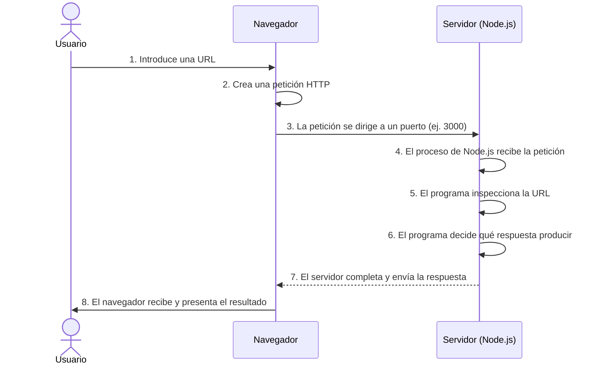

# Clase 1: Fundamentos y Primer Servidor en Node.js

## 1. Instrucciones para ejecutar
Para iniciar el servidor, abre la terminal en la carpeta raíz del proyecto y ejecuta el siguiente comando:
```bash
node src/server.js
```
El servidor estará escuchando en el puerto 3000. Puedes probar su funcionamiento visitando `http://localhost:3000` en tu navegador web.

## 2. Diagrama del recorrido de una petición
A continuación se ilustra el ciclo de vida de una petición HTTP básica:



## 3. Reporte de Falla (Laboratorio): fault-1.js

**1. Comportamiento observado**
Al ingresar a `http://localhost:3000/health` en el navegador, la pestaña se queda cargando de manera indefinida. Sin embargo, al revisar la terminal, el servidor imprime `GET /health`, indicando que no hay un error de arranque y que la petición efectivamente llegó al servidor.

**2. Hipótesis inicial**
Si la terminal registra la llegada de la petición a la ruta `/health` pero el navegador se queda esperando, es probable que el flujo del código ingrese al bloque condicional correspondiente, pero falte la instrucción necesaria para finalizar y enviar la respuesta al cliente.

**3. Evidencia revisada**
Al revisar el código fuente, específicamente en el bloque de la ruta `/health`, se observa que se configuran el código de estado (200) y las cabeceras, pero a diferencia del bloque de la ruta raíz `/`, no existe la instrucción `response.end()` antes del `return;`.

**4. Causa encontrada**
La ausencia del método `response.end()` provoca que la conexión HTTP permanezca abierta. El servidor nunca le comunica al navegador que terminó de procesar la solicitud, ocasionando un "Timeout" en el cliente.

**5. Modificación realizada**
Se agregó la llamada a `response.end('OK');` justo antes de la instrucción `return;` dentro del bloque condicional de la ruta `/health`.

**6. Resultado obtenido**
Al reiniciar el servidor y visitar `/health`, la página carga de inmediato mostrando el texto `OK`. El resto de las rutas continúan funcionando correctamente según lo esperado.

**7. Explicación final**
El proceso de Node.js actúa como un servidor de peticiones y respuestas. El protocolo exige explícitamente finalizar la escritura de la respuesta y cerrar la comunicación para que el navegador pueda presentar la información al usuario.

## 4. Ticket de Salida

*   **¿Qué diferencia esencial existe entre frontend y backend?**
    El frontend es la parte visual y de interacción con el usuario (HTML, CSS y JS del lado del cliente). El backend es el "detrás de escena" que corre en un servidor (como nuestro programa en Node.js); se encarga de la lógica de negocio, procesar datos y responder a las peticiones del frontend.
*   **¿Por qué el proceso de Node.js continúa activo después de ejecutar el archivo?**
    Porque usamos el método `server.listen()`. Esto le indica a Node.js que deje un proceso en estado de "escucha" aguardando que lleguen peticiones HTTP a través del puerto especificado.
*   **Si el navegador queda esperando indefinidamente, ¿qué revisarías primero?**
    Revisaría primero el código del servidor correspondiente a la ruta solicitada para asegurarme de que la respuesta HTTP se esté cerrando correctamente utilizando un método como `response.end()`.
*   **Describe con tus propias palabras el recorrido de una petición:**
    El usuario ingresa una URL en el navegador. El navegador crea una petición HTTP y la envía al puerto del servidor. El proceso de Node.js recibe la petición, evalúa la ruta, define el código de estado y el contenido. Finalmente, el servidor completa y envía la respuesta de vuelta para que el navegador la presente.
*   **¿Qué evidencia usarías para saber si el problema está en el navegador o en el servidor?**
    Utilizaría la consola del servidor y la pestaña 'Network' del navegador. Si la consola del servidor registra la llegada de la petición, el problema probablemente está en el backend. Si el servidor ni siquiera la registra, podría ser un problema de conexión o error en la URL enviada por el cliente.

## 5. Sección de Profundización: Client-Server Overview

*   **Un concepto nuevo que aprendiste o reforzaste:**
    Reforcé que la comunicación cliente-servidor tiene dos partes fundamentales: el *header* (cabecera con metadata y códigos de estado) y el *body* (el documento real). También aprendí que los parámetros de una petición `GET` viajan visibles en la URL, mientras que `POST` oculta sus datos en el cuerpo de la petición.
*   **Cómo se relaciona este concepto con el servidor creado:**
    Se relaciona directamente porque nuestro código intercepta este proceso manualmente. En nuestro servidor usamos instrucciones para armar exactamente la cabecera HTTP (`response.statusCode = 200`, `response.setHeader`) antes de enviar el cuerpo del mensaje con `response.end()`.
*   **Algo que no comprendiste del todo o te generó dudas:**
    Me generó dudas entender completamente cómo maneja el protocolo el parámetro `Keep-Alive` mencionado en los headers, y cómo el servidor determina el momento exacto para cerrar definitivamente una conexión si el usuario sigue navegando en el sitio.
*   **Cómo lo investigarías o dónde buscarías la respuesta:**
    Para investigar el ciclo de vida de la conexión, consultaría la documentación oficial de Node.js (específicamente la API del módulo HTTP) para ver las configuraciones de tiempo de espera y manejo de conexiones persistentes.

## 6. AI Usage

Para el desarrollo de esta actividad, se hizo uso de un asistente de Inteligencia Artificial como herramienta de apoyo educativo bajo el siguiente enfoque:
*   **Diagnóstico de fallas:** Asistencia estructurada para aplicar el método científico en la depuración del código fuente de Node.js, validando hipótesis lógicas antes de modificar los archivos.
*   **Generación de diagramas:** Soporte en la sintaxis de código Mermaid.js para graficar adecuadamente el flujo de peticiones y respuestas HTTP.
*   **Análisis de recursos:** Ayuda para sintetizar lecturas técnicas externas y conectar los conceptos de la documentación con el código implementado en clase.