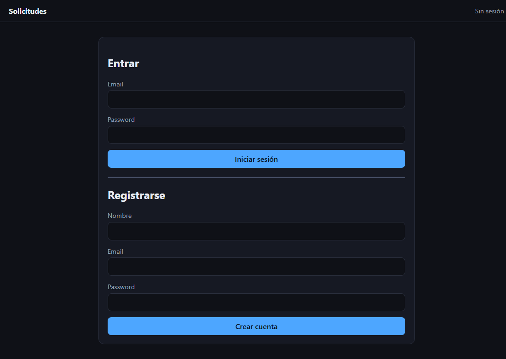
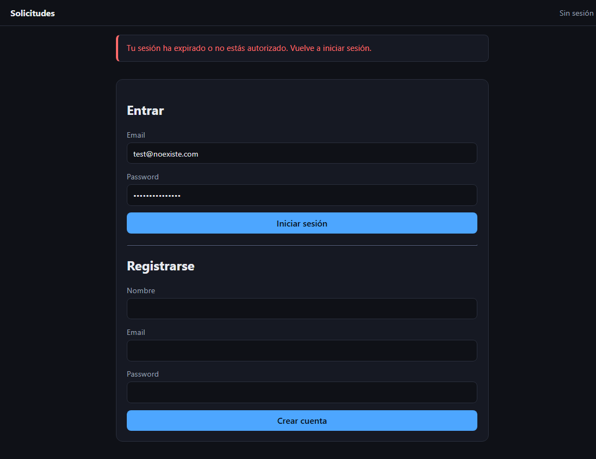
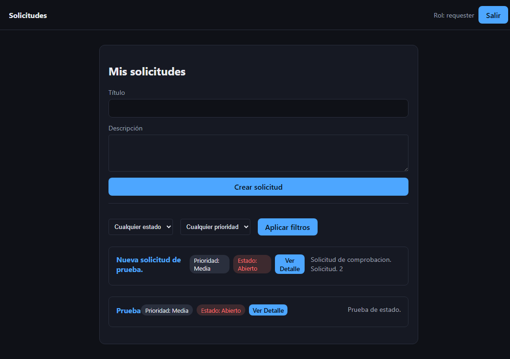
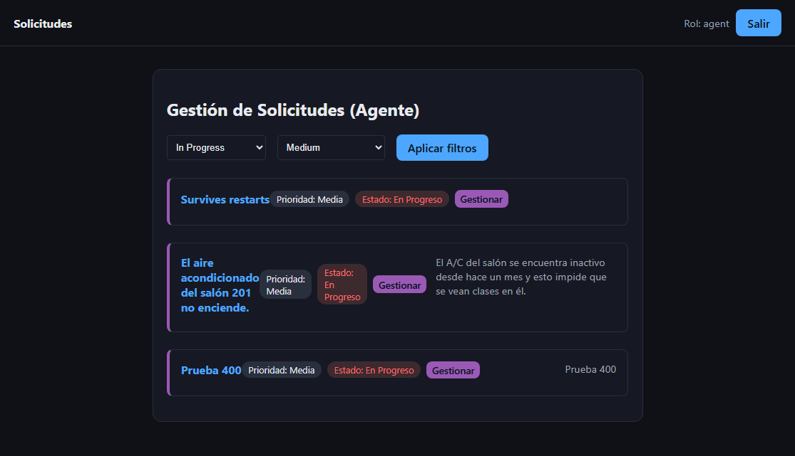
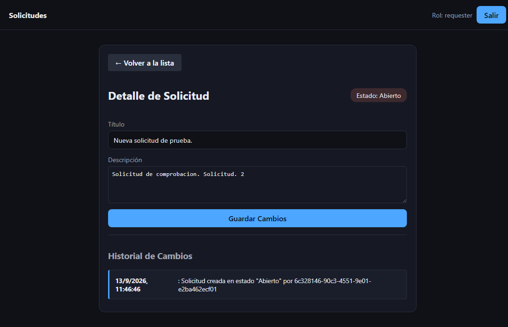
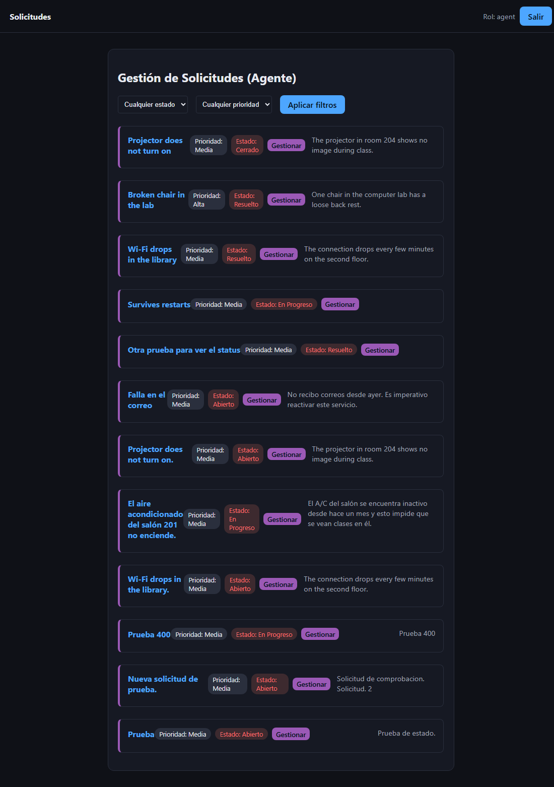
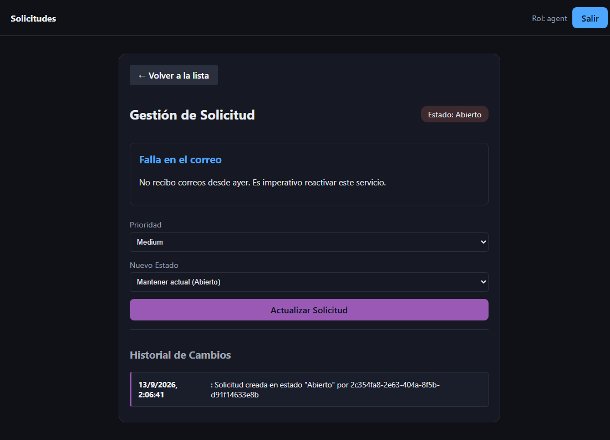
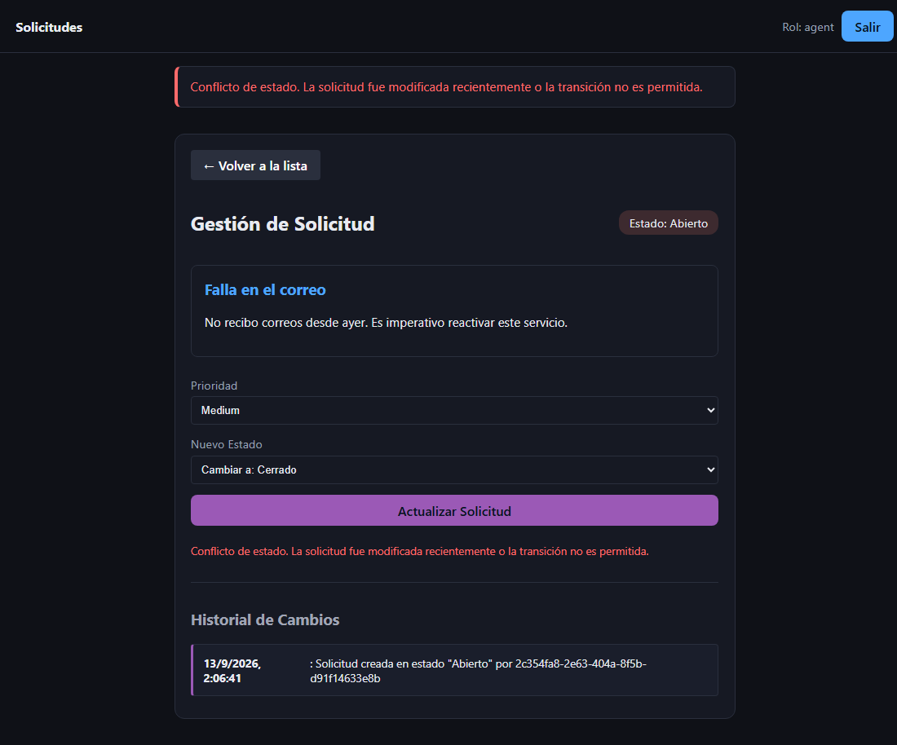
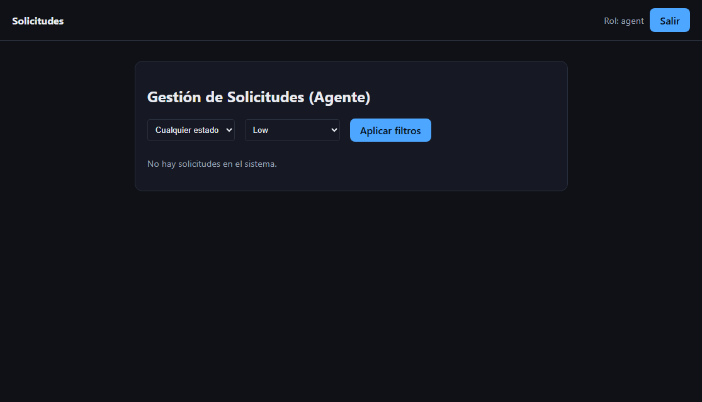

# Request Frontend — Entrega 05A

Interfaz gráfica en Vanilla JavaScript y Vite que consume la API REST de gestión de solicitudes.

## Arranque

```bash
npm install
cp .env.example .env      # VITE_API_URL apuntando a tu backend
npm run dev               # http://localhost:5173
```

En el backend, `.env` debe tener `FRONTEND_ORIGIN=http://localhost:5173` para que CORS acepte las peticiones.

## La decisión del token (Almacenamiento y Seguridad)

Para esta implementación, se ha decidido almacenar el JWT en `sessionStorage`. 

**Justificación técnica:** 
Se descartó el uso de `localStorage` debido a que este persiste la información incluso después de cerrar el navegador, aumentando la ventana de exposición. `sessionStorage` proporciona una capa adicional de seguridad pasiva: el token y la sesión se destruyen automáticamente cuando el usuario cierra la pestaña o el navegador. 

**Riesgo asumido:**
Reconozco explícitamente que utilizar `sessionStorage` (al igual que cualquier almacenamiento accesible mediante JavaScript) expone la aplicación a ataques **XSS (Cross-Site Scripting)**. Si un atacante logra inyectar código malicioso en el frontend, podría leer el token mediante `sessionStorage.getItem('token')` y suplantar la identidad del usuario. Esto se mitiga parcialmente evitando la inserción de HTML crudo no sanitizado en el DOM.

## Evidencia Visual de la Implementación

A continuación, se presenta la matriz de escenarios probados y el flujo completo de la aplicación:

### 1. Autenticación y Errores
*Formularios de inicio y error HTTP 400/401 devuelto por la API.*



### 2. Flujo del Requester
*Panel principal, filtrado de solicitudes y vista de detalle con historial.*




### 3. Flujo del Agente
*Vista exclusiva de gestión, ocultando creación y limitando transiciones de estado.*



### 4. Manejo de Estados y Conflictos
*Validación de conflictos (409), caída de red (503) y estados vacíos (empty).*


